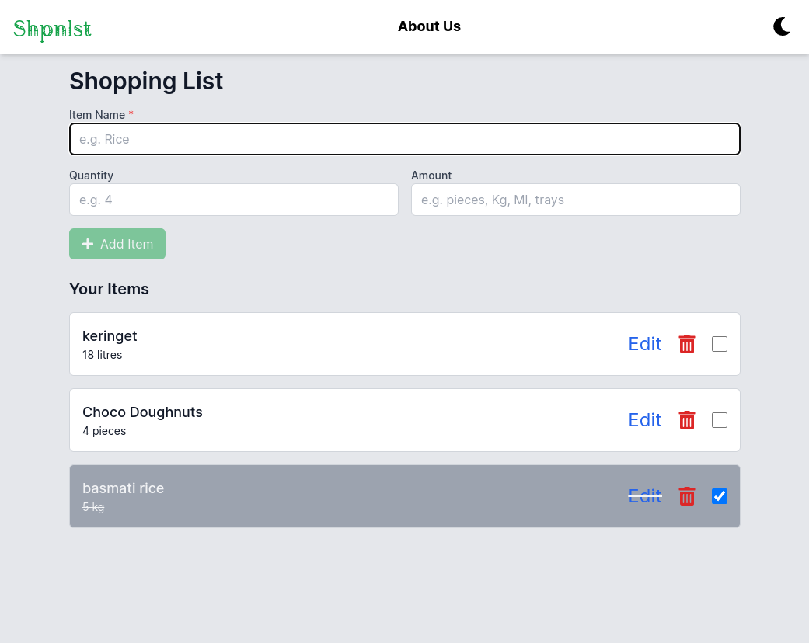

# Web-based Shopping List

<div style="display: flex; justify-content: space-between; margin-bottom: 40px;">
  
  
</div>


- A simple web-based shopping list application built using React and local storage. This app allows users to add, edit, and remove items from their shopping list, and the data is saved in the browser's local storage for persistence across sessions.

## Table of Contents

- [Features](#features)
- [Tech Stack](#tech-stack)
- [Installation](#installation)
- [Usage](#usage)
- [Contributing](#contributing)
- [License](#license)

## Features

- `CRUD` `Create`, `Read`, `Update` and `Delete` shopping list items
- Store shopping list data in local storage for persistence
- Simple, intuitive UI built with React
- Lightweight and easy to use

## Tech Stack


 
 

 
 

 


## Installation

To get started with the project locally, follow these steps:

1. **Clone the repository**:
   ```bash
   git clone https://github.com/YOUR_USERNAME/shopping-list.git
   ```

2. **Navigate to the project directory**:
   ```bash
   cd shopping-list
   ```

3. **Install the dependencies**:
   ```bash
   pnpm install
   ```

4. **Start the development server**:
   ```bash
   pnpm run dev
   ```

- The app should be running as below
```sh
     VITE v6.0.6  ready in 301 ms

  ➜  Local:   http://localhost:5173/
  ➜  Network: http://192.168.1.101:5173/
  ➜  press h + enter to show help
```

## Usage

Once the app is running, you'll be able to:

- **Add an item**: Type the item name in the input field and click the "Add" button.
- **Edit an item**: Click the edit button next to an item to modify it.
- **Delete an item**: Click the delete button next to an item to remove it from the list.
- All changes are automatically saved to local storage, so your shopping list persists even if you refresh or close the browser.

## Contributing

We welcome contributions to improve this project! Please follow the guidelines below for contributing:

1. Fork the repository to your GitHub account.
2. Clone your forked repository to your local machine.
3. Make your changes and commit them with clear, descriptive commit messages.
4. Push your changes back to your fork:
```bash
   git push 
```
5. Submit a pull request (PR) to the original repository with a description of your changes.

For more detailed information on contributing, please refer to the [Contributing Guide](CONTRIBUTING.md).

## License

This project is licensed under the MIT License. See the [LICENSE](LICENSE) file for more details.

---

### Notes:

- Replace `YOUR_USERNAME` in the repository URL with your actual GitHub username.

